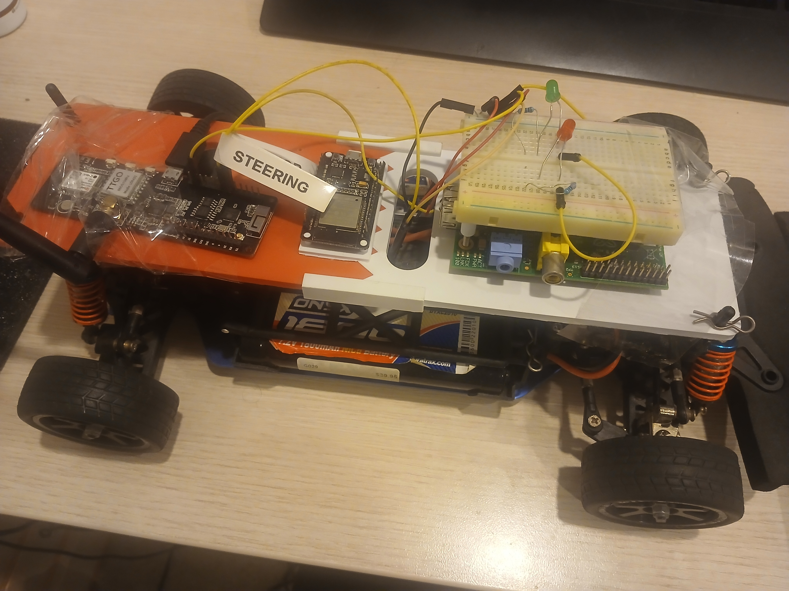

# DonkeyBot

LoRa-controlled RC racecar. Drive it from your phone with a joystick app while wearing FPV goggles.



The TTGO T-Beam on the car receives steering and throttle commands over LoRa and drives the steering servo and ESC directly. A second TTGO — mounted on the back of a phone via a 3D printed QuadLock adapter — relays Bluetooth commands from the phone app over LoRa to the car.

## Architecture

Final working setup:

```
Phone
└── BluetoothJoystick (Kotlin app)
    └── Bluetooth
        └── TTGO T-Beam on phone (LoRa-BT-Relay firmware)
            └── LoRa
                └── TTGO T-Beam on car (DonkeyDriver firmware)
                    ├── PWM → Steering servo
                    └── PWM → ESC (throttle)
```

The FPV camera on the car feeds goggles directly — range is limited by the FPV video link, not LoRa.

## Hardware

| Component | Notes |
|-----------|-------|
| TTGO T-Beam V1.1 (×2) | ESP32 + LoRa + GPS + AXP202 power management |
| HL Lightning No.3851 | 1/10 scale RC racecar, 540 class motor, 120A ESC |
| FPV camera + goggles | Video link for first-person driving |
| Android phone | Runs BluetoothJoystick |
| Xbox controller | Used with DonkeyController (laptop setup) |
| 3D printed platform | Mounts TTGO + breadboard on car |
| 3D printed phone mount | QuadLock base + TTGO platform, superglued |

STL files for both 3D printed parts are in `models/`. Reference images for the TTGO T-Beam V1.1 (pinmap and dimensions schematic) are in `assets/`.

## Repository Structure

| Directory | Language | Description |
|-----------|----------|-------------|
| `DonkeyDriver/` | C++ (PlatformIO) | Firmware for the TTGO on the car. Receives LoRa commands and drives the steering servo and throttle ESC via PWM. |
| `DonkeyController/` | Python | Desktop controller. Reads an Xbox controller and sends commands to the LoRa relay over USB serial. |
| `LoRa-2-Serial Relay/` | C++ (PlatformIO) | Relay firmware. Reads commands from a serial port and retransmits them over LoRa. Used with DonkeyController on a laptop. |
| `LoRa-BT-Relay/` | C++ (PlatformIO) | Relay firmware. Reads commands over Bluetooth and retransmits them over LoRa. Ran on the TTGO mounted to the back of a phone. |
| `BluetoothJoystick/` | Kotlin (Android) | Android app with a joystick UI. Sends steering and throttle values to the TTGO on the phone over Bluetooth. |
| `AndroidController_BLE/` | React Native (TypeScript) | Earlier attempt at an Android controller app. Abandoned — frequent UI hierarchy updates caused by the joystick tracking and live telemetry text made it too slow. |
| `LoRa-LCD/` | C++ (PlatformIO) | Exploratory script for sending messages over LoRa and displaying them on an LCD. Used to verify the LoRa link before integrating it into the main firmware. |
| `assets/` | — | TTGO T-Beam V1.1 pinmap and dimensions schematic. |
| `models/` | STL | 3D printable parts: QuadLock base and TTGO mounting platform for the phone mount. |

## How It Works

`DonkeyDriver` receives a two-value packet over LoRa — steering angle and throttle percentage. `Steering.cpp` maps the angle to a servo pulse width; `Motor.cpp` maps the throttle to an ESC PWM signal. Both run on the LEDC peripheral.

The phone-side TTGO (`LoRa-BT-Relay`) acts purely as a wireless bridge: it accepts a serial-style command string over Bluetooth from `BluetoothJoystick` and retransmits it over LoRa verbatim.

## Controller Evolution

The controller setup went through a few iterations before landing on BluetoothJoystick:

1. **Laptop + Xbox controller** *(preferred)* — `DonkeyController` (Python) reads the controller and sends commands over USB serial to a `LoRa-2-Serial Relay` TTGO plugged into the laptop. Wearing the FPV goggles with a proper controller in hand made the car much easier to drive. Required a laptop.

2. **React Native phone app** — `AndroidController_BLE` attempted to move control to a phone. The joystick position and a live value updating every frame caused too many UI hierarchy invalidations; React Native couldn't keep up.

3. **Kotlin phone app** — `BluetoothJoystick` rewrote the controller natively in Kotlin. Native Android views handle the joystick and BLE updates without performance issues. More portable than the laptop setup, but harder to drive with a single finger on a touchscreen joystick.

## License

MIT
